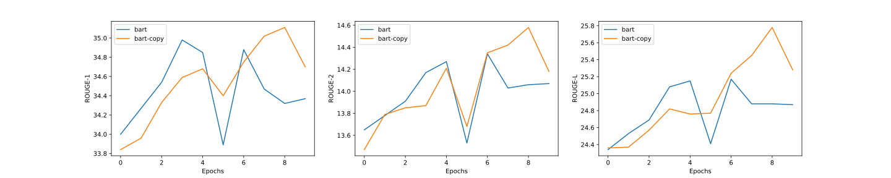

# transformers-copy-mechanism

[中文版](README_zh.md)

## Introduction

1. This code overwrites huggingface BART (`BartForConditionalGeneration`) and GPT2 (`GPT2LMHeadModel`) for seq2seq, adding copy mechanism to these two models, and is compatible with the huggingface training and decoding pipeline.
2. Not yet support Out-Of-Vocabulary (OOV) words.

## Results

For summarization task, the code is experimented on a [subset of CNN/DailyMail dataset](https://pan.baidu.com/s/1QXS7oQazLFUJbYD1L0OYSQ?pwd=uqw2), where 10k of the training set is used to train for **10 epochs** and 500 of the test set is used for evaluation. The results are as follows:

|Model Type|ROUGE-1|ROUGE-2|ROUGE-L|
|:--|:--|:--|:--|
|bart|34.88|14.34|25.17|
|bart-copy|35.11|14.58|25.78|



## Usage

See also `train_summary.sh` and `decode_summary.sh`

### Train

```sh
python3 -m torch.distributed.launch --nproc_per_node 4 run_summary.py train \
    --model_type bart-copy \
    --model_name_or_path fnlp/bart-base \
    --batch_size 16 \
    --src_file cnndm-10k/training.article.10k \
    --tgt_file cnndm-10k/training.summary.10k \
    --max_src_len 768 \
    --max_tgt_len 256 \
    --seed 42 \
    --output_dir ./output_dir \
    --gradient_accumulation_steps 2 \
    --lr 0.00003 \
    --num_train_epochs 10 \
    --fp16
```

Options:

- `--model_type` should be `bart`, `bart-copy`, `gpt2` or `gpt2-copy`
- `--model_name_or_path` is the local or remote path of the huggingface pretrained model

### Decoding

```sh
python3 -u run_summary.py decode \
    --model_type bart-copy \
    --model_name_or_path fnlp/bart-base \
    --model_recover_path ./output_dir/checkpoint-xxx/pytorch_model.bin \
    --batch_size 16 \
    --src_file cnndm-10k/test.article.500 \
    --tgt_file cnndm-10k/test.summary.500 \
    --max_src_len 768 \
    --max_tgt_len 256 \
    --seed 42 \
    --beam_size 2 \
    --output_candidates 1\
    --do_decode \
    --compute_rouge
```

Options:

- `--model_recover_path` is the path of the fine-tuned model
- `--beam_size` is the beam size of beam search
- `--output_candidates` specifies how many candidates of beam search to be output to file, which should be larger than 0 and no more than the `beam_size`
- `--do_decode`: Whether to do decoding
- `--compute_rouge`: Whether to compute ROUGE score after decoding. If `output_candidates > 1`, the average ROUGE score of all candidates will be calculated.

P.S. If the `model_recover_path` is `./output_dir/checkpoint-xxx/pytorch_model.bin`, the decoding output file will be `./output_dir/checkpoint-xxx/pytorch_model.bin.decode.txt`

## Other Settings

|Setting|Value|
|:--|--:|
|GPUs|4 TITAN XP 12GB|
|Pretrained Model|[fnlp/bart-base](https://huggingface.co/fnlp/bart-base-chinese)|
|Max Source Length|768|
|Max Target Length|256|
|Learning Rate|3e-5|
|Num Train Epochs|10|
|Train Batch Size|16|
|Gradient Accumulation Steps|2|
|Seed|42|
|Beam Size|2|
|Mixed Precision Training|yes|

P.S. The copy mechanism requires more CUDA memory during decoding.
