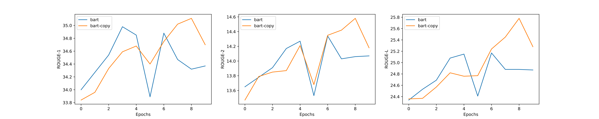

# transformers-copy-mechanism

[English](README.md)

## 介绍

1. 该代码覆写了huggingface的BART(BartForConditionalGeneration)和GPT2(GPT2LMHeadModel)模型，加入了拷贝机制，兼容huggingface的训练和解码流程
2. 暂不支持 Out-Of-Vocabulary (OOV) 词汇

## 结果

选用了[CNN/DailyMail数据集的子集](https://pan.baidu.com/s/1QXS7oQazLFUJbYD1L0OYSQ?pwd=uqw2)来验证拷贝机制在摘要任务中的效果。选择了原始训练集中的前1万条训练了10个epochs，并选用原始测试集中的前500条进行评估。结果如下：

|Model Type|ROUGE-1|ROUGE-2|ROUGE-L|
|:--|:--|:--|:--|
|bart|34.88|14.34|25.17|
|bart-copy|35.11|14.58|25.78|

从下面的ROUGE分数图像可以看出, 在前10个epochs中，`bart`相比`bart-copy`收敛到了更低的上界：



## 使用方法

另可详见`train_summary.sh`和`decode_summary.sh`

### 安装

```sh
pip install -r requirements.txt
```

### 训练

```sh
python3 -m torch.distributed.launch --nproc_per_node 4 run_summary.py train \
    --model_type bart-copy \
    --model_name_or_path fnlp/bart-base \
    --batch_size 16 \
    --src_file cnndm-10k/training.article.10k \
    --tgt_file cnndm-10k/training.summary.10k \
    --max_src_len 768 \
    --max_tgt_len 256 \
    --seed 42 \
    --output_dir ./output_dir \
    --gradient_accumulation_steps 2 \
    --lr 0.00003 \
    --num_train_epochs 10 \
    --fp16
```

参数说明:

- `--model_type`应为`bart`, `bart-copy`, `gpt2`或`gpt2-copy`
- `--model_name_or_path`是huggingface预训练模型的路径（本地或远程路径）

### 测试

```sh
python3 -u run_summary.py decode \
    --model_type bart-copy \
    --model_name_or_path fnlp/bart-base \
    --model_recover_path ./output_dir/checkpoint-xxx/pytorch_model.bin \
    --batch_size 16 \
    --src_file cnndm-10k/test.article.500 \
    --tgt_file cnndm-10k/test.summary.500 \
    --max_src_len 768 \
    --max_tgt_len 256 \
    --seed 42 \
    --beam_size 2 \
    --output_candidates 1\
    --do_decode \
    --compute_rouge
```

参数说明:

- `--model_recover_path`是fine-tuned模型的路径
- `--beam_size`是beam search中beam的大小
- `--output_candidates`指定输出多少个beam search的候选结果，必须大于0小于`beam_size`
- `--do_decode`: 是否进行解码
- `--compute_rouge`: 解码后是否计算ROUGE分数。如果`output_candidates > 1`，计算的是所有候选结果ROUGE的平均值。

P.S. 如果`model_recover_path`是`./output_dir/checkpoint-xxx/pytorch_model.bin`，解码结果会输出到`./output_dir/checkpoint-xxx/pytorch_model.bin.decode.txt`

## 其他设定

|Setting|Value|
|:--|--:|
|GPUs|4 TITAN XP 12GB|
|Pretrained Model|[fnlp/bart-base](https://huggingface.co/fnlp/bart-base-chinese)|
|Max Source Length|768|
|Max Target Length|256|
|Learning Rate|3e-5|
|Num Train Epochs|10|
|Train Batch Size|16|
|Gradient Accumulation Steps|2|
|Seed|42|
|Beam Size|2|
|Mixed Precision Training|yes|

P.S. 解码时拷贝机制需要占用更多显存
